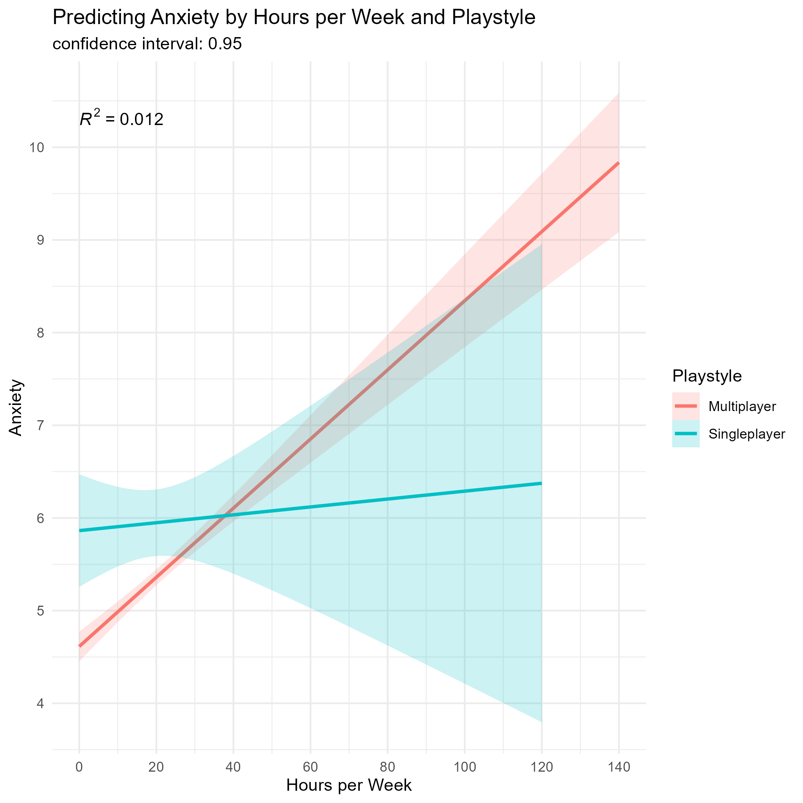
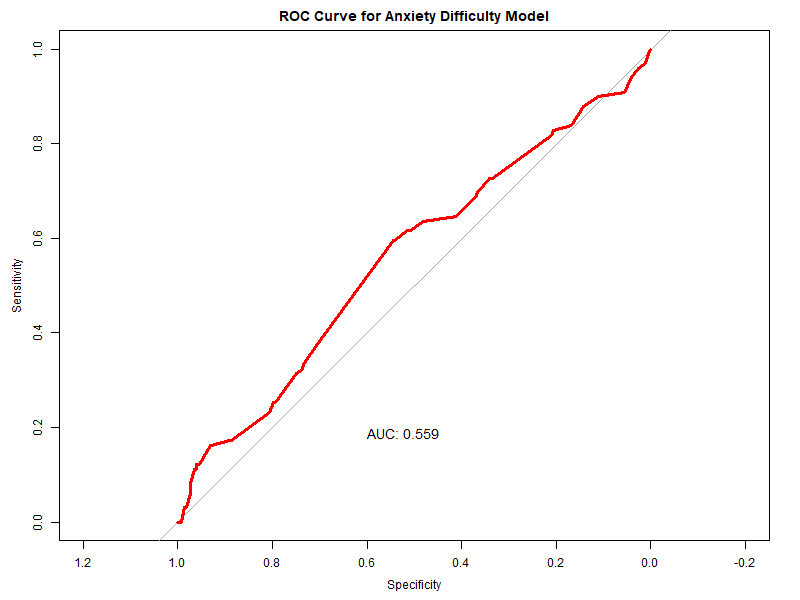

# Final-R-Project: Gaming Survey Data Research Analysis
 
## General Information
This dataset, called "Online Gaming Anxiety Data", was collected from gamers worldwide, and retrieved from the kaggle.com website. It has psychological measures of anxiety, social anxiety and well being, in addition to gaming preferences and habits and demographic information. I picked it because I really enjoy gaming, and have always wondered about the negative label people put on it. It is mostly researched as an anxiety inducing practice, or socially isolating, etc. I believe that, as most things in life, gaming's effect depends on many variables, so that the negative effects don't neccessarily comes from gaming itself, but more from gaming online. In my view, gaming alone actually has many positive effects. These are the things I set to learn about from this analysis.

## Research Question
What is the relationship between anxiety and it's debilitating effect, in terms of time investment and gaming playstyle?  
To answer this question, I've tested the association between self-reported general anxiety, as measured by GAD - General Anxiety Disorder scale (0-21, higher score equals higher anxiety levels), reported hours spent gaming per week and gaming online (multiplayer) or offline (singleplayer). In addition, I've tested the association between the perceived debilitating effect of anxiety and hours played, specifically in singleplayer-offline gamers.

### Hypothesys
My hypothesis is that gaming more hours alone would predict higher anxiety, but that the effect would be attenuated or reversed when playing singleplayer, in comparison to multiplayer. I also hypothesize that within singleplayer gamers, gaming more would be associated with a decreased anxiety debilitating effect, since it should have a calming effect to help against anxiety. Importantly, it needs to be said that no causality can be inferred from this research analysis, since only correlations of a survey are at hand.

## Data Processing and Data Filtering Notes
### Required Packeges
To run my analysis on your own and view the non-attached graphs, you will need Rstudio or another program that runs R, and the following packages:
1. ggplot2
2. dplyr
3. patchwork
4. pROC
5. stringr  
If you don't have any of these, you can run the following command in Rstudio to install them:
```r
install.packages('name_of_package')
```

### Excluded Data
For my research, I had removed all participants that answered "other" in any of the survey questions, since they wouldn't fit any specific category in my analysis. In addition, anyone that reported playing more hours than two SD's of hours per week (144) was excluded, on the basis of being extreme observations. Lastly, any participant that didn't answer one of the analysis based questions (General Anxiety Disorder, anxiety debilitating effect, hours per week gaming or playing single/multiplayer) was also excluded.
#### Overall Participant Numbers:
Amount who completed the survery:                 13464  
Amount after filtering:                           12041  
Amount of singleplayer gamers after filtering:    701

### Anxiety-Debilitating-Effect Coding
I chose to refer to the anxiaty debilitating effect as **low debilitating** when a participant answered "Not difficult at all" or "Somewhat difficult", and **highly debilitating** when they answered "Very difficult" or "Extremely difficult".

## Data Analysis
### Inferential Statistics
For my analysis, I used two regressions:
1. **Multiple Linear Regression**: Predicting anxiety using hours gaming per week, playstyle (single/multiplayer) and their interaction.
2. **Logistic Regression**: Predicting anxiety debilitating properties using hours gaming per week, in singleplayer gamers only.

### Results
As hypothesized, more gaming hours were associated with more anxiety mostly in multiplayer gamers (β1 = .037, _p_ = 2 * 10^-16), an effect that was almost completely attenuated in singleplayer gamers (β3 = -.033, _p_ = .0115). These results suggests that for multiplayer gamers, each hour spent gaming increases anxiety levels by 0.037 points, but with singleplayer gamers this decreases by 0.033 points, resulting in a weaker effect of only 0.004 increase in anxiety for singleplayer gamers for each additional hour.  
Another result concluded from the regression is that when not gaming at all (hours per week = 0), singleplayer gamers report about 1.249 points higher anxiety than multiplayer gamers (β2 = 1.249, p = 4.9 * 10^-5).  
Still, the R squared of the model was quite low (R^2 = .012), which means very little variance could be explained by it (1.2%). This means that other untested measures probably have a bigger role in this effect on anxiety.


Contrary to my second hypothesis, in singleplayer gamers, hours spent gaming per week was a significant predictor of experiencing debilitating anxiety effects (β = .015, _p_ = .0251, OR = 1.015). The odds ratio suggests that for each additional hour spent gaming per week, the odds of reporting highly debilitating anxiety is increased by 1.5% multiplicatively. That being said, the AUC = .559 was quite small, meaning the model is not a very good one, since it is not that different than chance level (.50).


