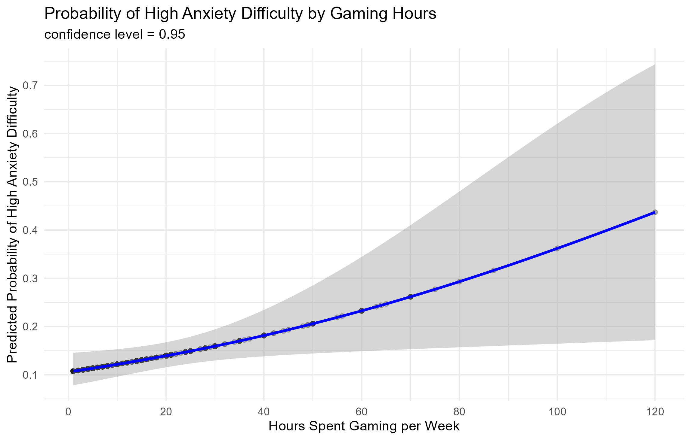

# Final-R-Project: Gaming Survey Data Research Analysis
 
## General Information
This data was collected from gamers worldwide. I picked it because I really enjoy gaming, and have always wondered about the negative label people put on it. It is mostly researched as an anxiety inducing practice, socially isolating, etc. I believe that, as most things in life, it depends on many variables, and that the negative effects don't neccessarily comes from gaming itself, but more from being online. That's one thing I set to research from this analysis.

## Research Question
What is the relationship between anxiety and it's debilitating effect, particularly in terms of time investment and social gaming preferences?
To answer this question, I've tested the association between self-reported general anxiety, as measured by GAD - General Anxiety Disorder scale (0-21, higher score equals higher anxiety levels), reported hours spent gaming per week, and gaming online (multiplayer) or offline (singleplayer). In addition, I've tested the association between the perceived debilitating effect of anxiety and hours played, specifically in singleplayer-offline gamers.

My hypothesys are that gaming more hours alone would predict higher anxiety, but that the effect would be attenuated or reversed when playing singleplayer, in comparison to multiplayer. In addition, I hypothesize that in the singleplayer population, gaming more would be associated with a decreased anxiety debilitating effect, since it should have a calming effect.

Final R project: research question, data processing, results and conclusions

## Data Processing and Filtering Notes
### Required Packeges
To run my analysis on your own and view the non-attached graphs, you will need Rstudio or another program that runs R, and the following packages:
1. ggplot2
2. dplyr
3. patchwork
4. pROC
If you don't have any of these, you can run the following command in Rstudio:
```r
install.packages("name_of_package")
```

### Excluded Data
For my research, I had removed all participants that answered "other" in any of the survey questions, since they wouldn't fit any specific category in my analysis. In addition, anyone that reported playing more hours than two SD's of hours per week (144) was excluded, on the basis of being extreme observations. Lastly, anyone that didn't answer one of the analysis based questions (General Anxiety Disorder, anxiety debilitating effect, hours per week gaming or playing single/multiplayer) was also excluded.
Amount who completed the survery: 13464
Amount after filtering:           12041

## Data Analysis
### Inferential Statistics
For my analysis, I used two regressions:
1. Multiple Linear Regression: predicting anxiety using hours gaming per week, playstyle (single/multiplayer) and their interaction.
2. Logistic Regression: predicting anxiety dibilitating properties using hours gaming per week, in singleplayer population only.

### Results
As was hypothesized, more gaming hours were associated with more anxiety mostly in the population playing multiplayer (β = .037, _p_ = 2*10^-16), an effect that was almost completely attenuated in the population playing singleplayer (β = -.032, _p_ = .0115). These results suggests that in the multiplayer population, each hour spent gaming increases anxiety levels by 0.037 points, but in the singleplayer population this decreases by 0.032 points (resulting in an overall increase of 0.005 for singleplayer).


Against my second hypothesis, in the singleplayer population, hours spent gaming per week was a significant predictor of experiencing debilitating anxiety effects (β = .016, _p_ = .021, odds ratio = 1.016). The odds ratio suggests that for each additional hour spent gaming per week, the odds of reporting high anxiety difficulty increase by about 1.6%. That being said, the AUC = .563 was quite small, meaning the model is not that good or different than chance level.


## Conclusions


